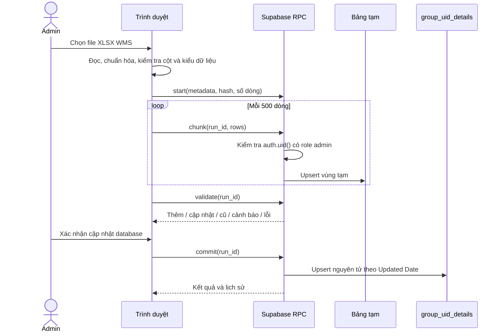

# Thiết kế nạp Group UID từ Excel trên màn Admin

## Kết luận

Hướng này khả thi với ứng dụng hiện tại. File WMS đang dùng có khoảng 8.148 dòng,
dung lượng khoảng 844 KB nên trình duyệt có thể đọc và kiểm tra tại chỗ. Admin đã
đăng nhập bằng Supabase Auth và được đối chiếu với `public.user_roles`, vì vậy có
thể cấp quyền nhập qua RPC mà không đưa `service_role` hoặc personal access token
vào `index.html`.

Nên triển khai theo luồng **Đọc file → Kiểm tra trước → Tải vùng tạm → Xác nhận
áp dụng**. Không cho frontend ghi trực tiếp vào `group_uid_details`.

## Giao diện đề xuất

Deep-link: `#admin/group-uid-data`

Do repository chỉ có bundle React đã nén, màn này nên là một section độc lập trong
`index.html`, cùng cách đang dùng cho `#group-uid`, `#inspection` và `#sample`.
Thêm nút **Dữ liệu Group UID** cạnh điều khiển phiên Admin, không sửa rộng bundle.

### Bước 1 — Chọn file

- Nút lớn: **Chọn file Excel WMS**.
- Chỉ nhận `.xlsx`, tối đa 10 MB và 50.000 dòng.
- Hiện tên file, dung lượng, ngày chọn và SHA-256 để nhận biết import lại cùng file.
- Đọc file trong trình duyệt; không tải file gốc lên Supabase Storage.

### Bước 2 — Kiểm tra

Hiện một bảng tóm tắt trước khi có bất kỳ thay đổi nào:

| Chỉ số | Ý nghĩa |
| --- | --- |
| Tổng dòng | Số Group UID hợp lệ đọc được |
| Thêm mới | Mã chưa có trong database |
| Cập nhật | Mã đã có và `Updated Date` mới hơn hoặc bằng |
| Bỏ qua dữ liệu cũ | Database đang có `Updated Date` mới hơn |
| SKU trống | Cho phép nhập, nhưng chưa tự lấy được tên sản phẩm |
| SKU chưa có trong `SKU_Name` | Cảnh báo; UID vẫn được nhập |
| Mã trùng trong file | Lỗi, phải sửa file trước khi áp dụng |
| Dòng lỗi | Thiếu mã, Qty sai, ngày sai hoặc thiếu Status |

Hiện tối đa 50 dòng lỗi đầu tiên với số dòng Excel, tên cột, giá trị và lý do.
Cho phép tải CSV lỗi để sửa nhanh khi số lỗi nhiều.

### Bước 3 — Áp dụng

- Nút **Cập nhật database** chỉ bật khi không còn lỗi chặn.
- Hộp xác nhận ghi rõ số dòng thêm, cập nhật, bỏ qua và cảnh báo SKU.
- Thanh tiến độ tách hai giai đoạn: `Tải dữ liệu 0–100%` và `Đang áp dụng`.
- Kết quả cuối: số thêm mới, cập nhật, bỏ qua dữ liệu cũ, thời gian và người thực hiện.
- Giữ lịch sử các lần import gần nhất ở cuối màn hình.

Mặc định là **upsert, không xóa**. Một mã không có trong file mới không bị xóa vì
file WMS có thể đã được lọc theo kho, trạng thái hoặc thời gian. Nếu sau này cần
đồng bộ toàn bộ snapshot, phải thêm chế độ riêng và yêu cầu xác nhận rõ file là
export đầy đủ.

## Ánh xạ dữ liệu

| Cột Excel WMS | Cột database | Quy tắc |
| --- | --- | --- |
| Group UID Code | `group_uid_code` | Bắt buộc, text, duy nhất trong file |
| Batch Code | `batch_code` | Text, cho phép trống |
| Roll Code | `roll_code` | Text, cho phép trống |
| Warehouse | `warehouse` | Text, cho phép trống |
| Location | `location` | Text, cho phép trống |
| SKU | `sku` | Text, cho phép trống |
| Qty | `qty` | Số hữu hạn, `>= 0` |
| Updated By | `updated_by` | Text, cho phép trống |
| Updated Date | `updated_date` | Bắt buộc; không có múi giờ thì hiểu UTC+07:00 |
| Status | `status` | Bắt buộc, giữ nguyên giá trị WMS |
| Product Name | — | Bỏ qua; tên lấy từ `SKU_Name.product_name` khi in |

Các cột WMS khác như `No.`, `RFID Mapping`, `Type`, `Product Qty`, `Barcode`,
`Weight(kg)`, `Carton Information`, `Note`, `Created By`, `Created Date` và
`SKU Qty` không được lưu vào bảng Group UID.

## Backend Supabase đề xuất

### Bảng tạm và lịch sử

`group_uid_import_runs`

- `id uuid primary key`
- `file_name`, `file_size`, `file_sha256`
- `expected_rows`, `uploaded_rows`
- `status`: `uploading`, `validated`, `applying`, `completed`, `failed`
- `created_by uuid`, `created_at`, `completed_at`
- các bộ đếm kết quả và `error_message`

`group_uid_import_rows`

- `run_id`, `row_no`
- 10 trường giống `group_uid_details`
- unique `(run_id, row_no)` và `(run_id, group_uid_code)`

Giữ metadata lịch sử lâu dài; xóa dữ liệu dòng tạm sau 7 ngày để tránh database
tăng không giới hạn.

### RPC

1. `group_uid_import_start(file_name, file_size, file_sha256, expected_rows)`
   tạo một lượt nhập và trả `run_id`.
2. `group_uid_import_chunk(run_id, rows jsonb)` nhận tối đa 500 dòng. Gọi lại cùng
   `run_id + row_no` không tạo bản sao.
3. `group_uid_import_validate(run_id)` kiểm tra đủ số dòng, trùng mã, dữ liệu bắt
   buộc, SKU chưa có và phân loại thêm/cập nhật/bỏ qua.
4. `group_uid_import_commit(run_id)` thực hiện một giao dịch upsert nguyên tử từ
   bảng tạm vào `group_uid_details`.
5. `group_uid_import_history(limit)` trả lịch sử để hiển thị trong Admin.

Mỗi RPC ghi dữ liệu phải tự kiểm tra:

```sql
exists (
  select 1 from public.user_roles
  where user_id = (select auth.uid()) and role = 'admin'
)
```

RPC dùng `security definer set search_path = ''`, định danh đầy đủ mọi bảng,
`revoke execute from public, anon` và chỉ `grant execute to authenticated`.
Không cấp `INSERT`, `UPDATE`, `DELETE` trực tiếp trên bảng Group UID cho frontend.

### Tính toàn vẹn

- Chỉ `commit` khi trạng thái là `validated` và `uploaded_rows = expected_rows`.
- Một lượt `commit` chỉ chạy một lần; gọi lại trả lại kết quả đã hoàn tất.
- `Updated Date` cũ không ghi đè bản ghi mới hơn.
- Toàn bộ upsert chạy trong một transaction. Lỗi một dòng thì không dòng nào được
  áp dụng.
- Hash file giúp cảnh báo file đã nhập, nhưng Admin vẫn có thể chủ động nhập lại;
  upsert và ngày cập nhật làm thao tác này an toàn.

## Luồng xử lý



## Xử lý lỗi và khôi phục

- Mất mạng khi tải: giữ `run_id` trong `sessionStorage`, cho bấm **Tiếp tục**;
  những chunk đã nhận không cần gửi lại.
- Đóng tab: lịch sử server vẫn giữ lượt `uploading`; Admin có thể tiếp tục hoặc
  hủy lần nhập đó khi mở lại.
- Sai file: chưa bấm xác nhận thì database chính chưa thay đổi.
- Lỗi khi `commit`: transaction rollback toàn bộ và lượt nhập chuyển `failed`.
- Phiên đăng nhập hết hạn: làm mới token theo cơ chế Admin hiện có rồi gửi lại
  chunk hoặc commit.

## Phạm vi triển khai đề xuất

### Giai đoạn 1

- Màn `#admin/group-uid-data`.
- Đọc XLSX, preview, báo lỗi và upsert không xóa.
- Staging, RPC kiểm tra Admin, lịch sử import.
- Kiểm thử file thật 8.148 dòng, file trùng, file sai cột, mất mạng giữa chừng,
  token hết hạn và hai Admin import đồng thời.

### Giai đoạn 2 nếu cần

- Tải CSV lỗi.
- Tiếp tục lượt upload bị gián đoạn sau khi mở lại tab.
- Chế độ snapshot đầy đủ có archive/xóa mã không còn trên WMS.
- Rollback theo một lượt import nếu nghiệp vụ thật sự cần.

## Giới hạn hiện tại

Repository không còn source React để sửa màn Admin gốc; chỉ có bundle production
đã nén. Màn import độc lập là thay đổi nhỏ và an toàn hơn trong cấu trúc hiện tại.
Nếu Admin tiếp tục mở rộng thêm nhiều chức năng dữ liệu, nên khôi phục source project
để tránh tích lũy các màn độc lập trong một file HTML lớn.
